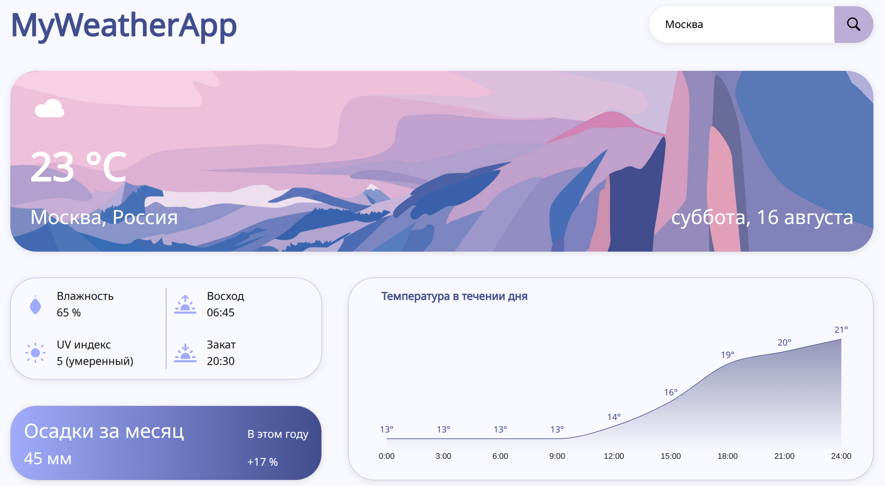

# MyWeatherApp — интерактивное приложение прогноза погоды

## 📖 Описание
**MyWeatherApp** — это современное веб-приложение для получения прогноза погоды в любом городе мира.  
Приложение использует **REST API** для загрузки актуальных данных, поддерживает **адаптивный дизайн** и предлагает **интуитивный интерфейс**.

---

## ✨ Ключевые функции
- 🔍 Поиск города и отображение текущей погоды
- 📍 Определение местоположения пользователя с автоматическим показом прогноза
- 🌡 Переключение между °C и °F

---

## 🛠 Используемые технологии
- **React** (Hooks, функциональные компоненты)
- **HTML5 / CSS3 / SASS**
- **JavaScript** 
- **REST API** (OpenWeather / Open-Meteo)
- **Git / GitHub Pages**
- **БЭМ**, адаптивная верстка

---
